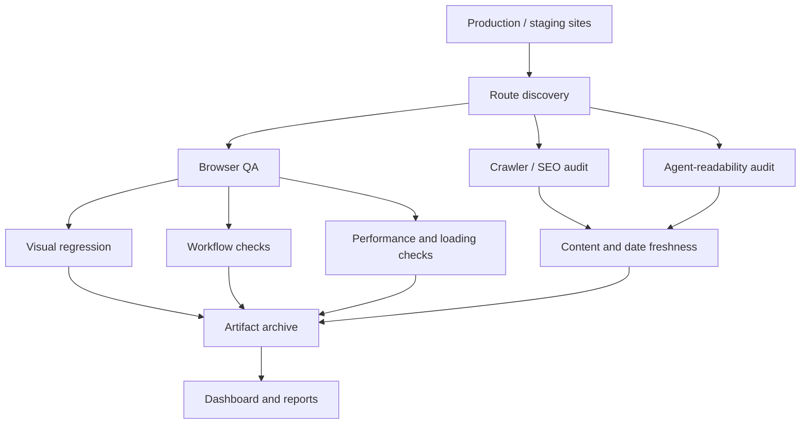

# System Architecture

The system should be built as a layered black-box monitor. Each layer catches a different failure class.

## Layers

1. **Route Discovery**
   - Production: prefer `sitemap.xml`, then crawl internal links.
   - Staging: no sitemap currently, so crawl from homepage plus configured seed URLs.
   - Migration: use explicit production-to-staging route mapping.

2. **Browser QA**
   - Playwright remains the deterministic core.
   - It should capture screenshots, click flows, read DOM state, trace failures, and export machine-readable results.

3. **Visual AI / Visual Regression**
   - Start with Playwright screenshots if cost matters.
   - Add Percy, Argos, or Applitools for approval workflow and better diff review.

4. **Synthetic Monitoring**
   - Checkly is the preferred first hosted layer because it runs Playwright checks as monitoring.
   - Datadog or Grafana can replace it if the team wants broader observability.

5. **Real Browser / Device Cloud**
   - BrowserStack is the preferred release-sweep provider.
   - Run broad real-device checks monthly and before launch, not necessarily on every PR.

6. **Performance History**
   - DebugBear or SpeedCurve should store long-term Core Web Vitals and synthetic performance trends.
   - WebPageTest is useful for filmstrips and deep loading diagnostics.

7. **Crawler / SEO / Content Health**
   - Sitebulb Cloud or Screaming Frog should run scheduled crawls.
   - Track sitemap health, redirects, canonicals, metadata, structured data, accessibility, and rendered HTML.

8. **Agent-Readability**
   - Validate `llms.txt`, Markdown mirrors, JSON-LD, semantic HTML, crawler access, and LLM answer quality.

## Storage

Recommended storage:

- R2/S3 for automation artifacts.
- Database table for run metadata and finding metadata.
- Google Drive only for human-friendly screenshot galleries, if desired.

Artifacts:

- full-page screenshots;
- visual diffs;
- Playwright traces;
- videos for failed flows;
- Lighthouse/WebPageTest/DebugBear output;
- crawler exports;
- markdown extraction output;
- LLM evaluation JSON.

## Baselines

Visual baselines must be approved manually. The system should never auto-accept visual changes after a passing run.

## Current Automation

The local repo includes `.github/workflows/site-qa.yml`.

Cadence:

- manual dispatch for `health`, `biweekly`, and `monthly`;
- biweekly candidate every Monday at `07:00 UTC`, skipped on odd ISO weeks;
- monthly broad sweep on the first day of each month at `08:00 UTC`.

Current generated artifacts:

- `reports/latest/report.json`;
- `reports/latest/summary.md`;
- `reports/latest/dashboard.html`;
- `artifacts/latest/screenshots/...`.
